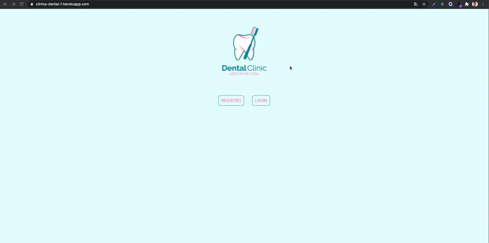

<p align="center"><a href="https://laravel.com" target="_blank"></a></p>

<p align="center">
<a href="https://travis-ci.org/laravel/framework"></a>
<a href="https://packagist.org/packages/laravel/framework"></a>
<a href="https://packagist.org/packages/laravel/framework"></a>
<a href="https://packagist.org/packages/laravel/framework"></a>
</p>

# Clinica Dental Database

_Este proyecto consiste en la creación de una base de datos para la gestión de citas de una clinica dental. Se ha realizado con una base de datos relaicional en Laravel con encriptación de password en el caso de registro de usuarios._

## Comenzando 🚀

_Para poder poner en funcionamiento el proyecto en tu maquina local para propositos de desarrollo y pruebas necesitaras:_

* [Descargar Repositorio Backend](https://github.com/javigarcias/clinica-dental-laravel-api)
* [Enlace Frontend](https://clinica-dental-f.herokuapp.com/)

- En el backend ejecutar:
```
php artisan serve
```


### Endpoints 📌
- /users:
    - POST /api/registro (Registro de cliente nuevo)
    - POST /api/login (Login cliente ya registrado)
    - GET /api/logout (logout cliente logeado)
- /citas:
    - POST /api/citas (Creación de nueva cita)
    - DELETE api/citas/{cita} (Cancelación de una cita)
    - GET api/user/{user}/citas (Ver citas de un usuario mediante su id)
    - GET api/indexAll (Ver todas las citas)


## Construido con 🛠️

_Tecnologías utilizadas en el proyecto_

- Javascript
- PHP
- Laravel
- Eloquent
- Artisan
- Postman
- Git
- GitHub

## Autor ✒️

* **Javier García**  - [javigarcias](https://github.com/javigarcias)

---
⌨️ con ❤️ por [JaviGarcia](https://www.linkedin.com/in/javigarciasanchez/) 😊